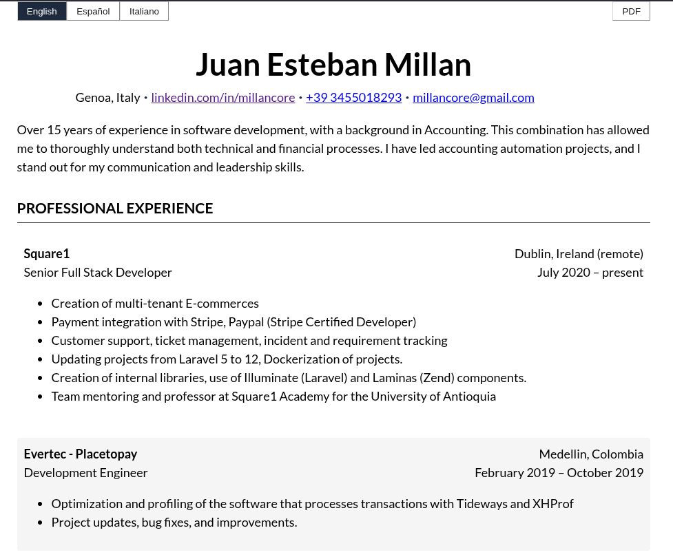

# Curriculum Vitae

Juan Millan
https://millancore.github.io/cv/

This project allows you to generate your own CV by editing a JSON file with your data.

## How to use

1.  **Download or clone the repository.**
2.  **Edit the data file:** Open the `data/en.json` file and modify its contents with your personal and professional information. You can use `data/es.json` or `data/it.json` as guides if you wish to create a version in a different language.
3.  **View your CV:** Run `npm run dev`
4.  **Github Pages** This project includes a Action pipeline to publish yor CV as Github pages.
